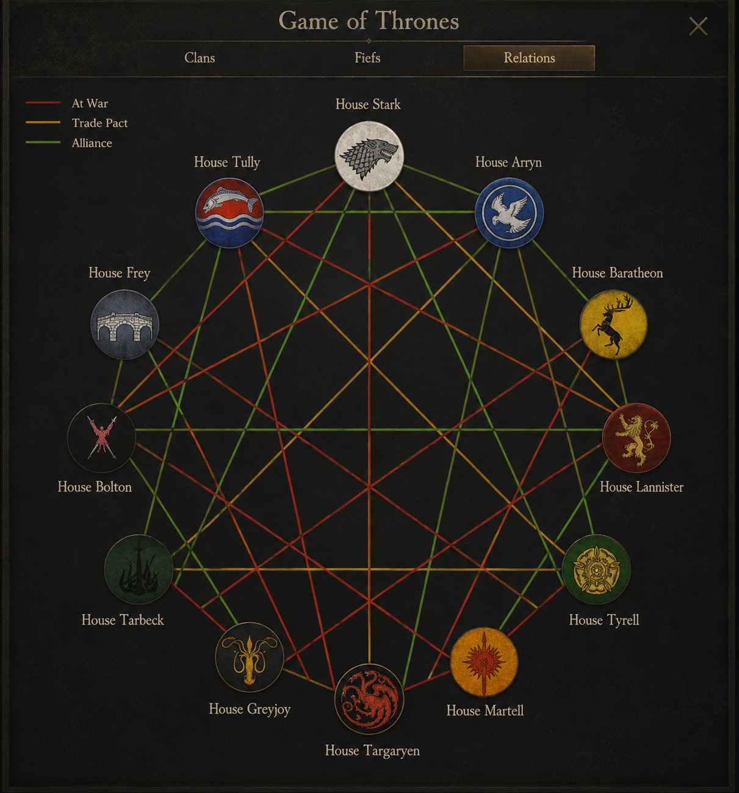

# Diplomacy Overview — Mount & Blade II: Bannerlord

A read-only **Relations** view for Bannerlord's Clan screen: every kingdom is a banner medallion on
a circle, with colored lines showing who is **at war**, **allied**, or bound by a **trade
agreement**. Toggle each relation type on or off, hover a line for the details, and click a medallion
to jump to its encyclopedia page. No relation, no line.

Inspired by the diplomacy web in *atWar*. **Reads your campaign, never touches it** — safe to add or
remove mid-campaign, writes nothing into your saves.

> _The image above is the original design reference. See the [Nexus page](#links) for screenshots of
> the mod in-game._

## Features

- **Relations web** — non-eliminated kingdoms as circular banner medallions, arranged so warring
  pairs sit across the ring; the web fits itself to worlds from a handful of kingdoms up to the
  90-plus of total conversions.
- **Three relation types**, all from native game data: **War** (red), **Alliance** (green), and the
  **Trade Agreements** added in game v1.4.7 (orange).
- **Legend toggles** — show/hide each relation type live; the label goes bright white when shown,
  grey when hidden.
- **Hover tooltips** — war casualties and tribute, alliance/trade expiry countdowns, per-kingdom
  trade gold — in the game's own tooltip style.
- **Click a medallion** → the faction's encyclopedia page. A subtle glow marks what you're hovering.

Where to find it: open your **Clan** screen → the **Relations** tab (between *Fiefs* and *Income*).

## Requirements

- **Mount & Blade II: Bannerlord v1.4.7** (+ War Sails DLC supported)
- [Harmony](https://www.nexusmods.com/mountandblade2bannerlord/mods/2006) (v2.4.2+)
- [UIExtenderEx](https://www.nexusmods.com/mountandblade2bannerlord/mods/2102) (v2.13.3+)

## Installation

1. Install the requirements above.
2. Download the latest release zip from [Releases](https://github.com/sum117/bannerlord-diplomacy-overview/releases)
   (or Nexus) and extract the `DiplomacyOverview` folder into
   `Mount & Blade II Bannerlord\Modules\`.
3. Enable **Diplomacy Overview** in the launcher (below Harmony and UIExtenderEx in load order).

## Compatibility

Additive-only UI injection (no Harmony patches of our own, no campaign mutation), so it composes
cleanly with other mods and is save-safe. Built and verified against vanilla v1.4.7 + War Sails.

## Roadmap

- **Clan scope** — a toggle to see which clans (including minor factions) are at war, not just
  kingdoms ([#8](https://github.com/sum117/bannerlord-diplomacy-overview/issues/8)).
- **Localization** — the strings are keyed; translation files are pending
  ([#11](https://github.com/sum117/bannerlord-diplomacy-overview/issues/11)).
- **Broader compat pass** — Realm of Thrones / BannerKings verification
  ([#12](https://github.com/sum117/bannerlord-diplomacy-overview/issues/12)).

## Links

- **Nexus Mods** — _page in setup_
- **[GitHub Releases](https://github.com/sum117/bannerlord-diplomacy-overview/releases)** — packaged builds
- **[Issues / roadmap](https://github.com/sum117/bannerlord-diplomacy-overview/issues)**
- **[Research & design docs](docs/research/README.md)** — environment, module anatomy, Gauntlet UI
  techniques, exact v1.4.7 diplomacy APIs, compatibility, architecture, and the numbered pitfalls list

## Development

C# targeting net472 / x64. Build with `dotnet build DiplomacyOverview.sln -c Debug` (auto-deploys to
your game's `Modules\` when `BANNERLORD_GAME_DIR` is set). See [AGENTS.md](AGENTS.md) for build
commands, hard rules, and conventions, and [docs/research/](docs/research/README.md) for the full
technical background.
